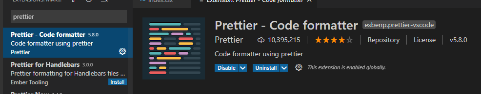
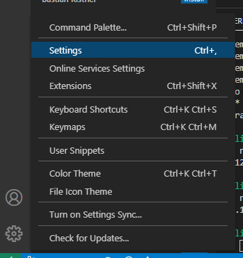
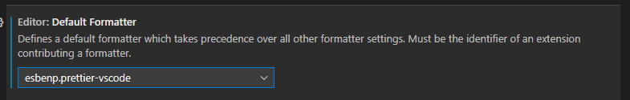
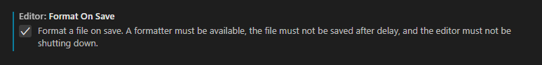
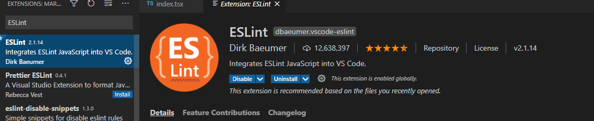
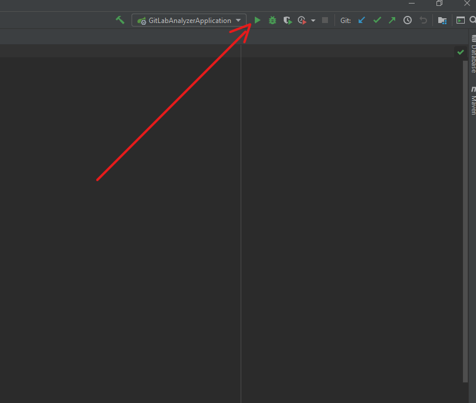
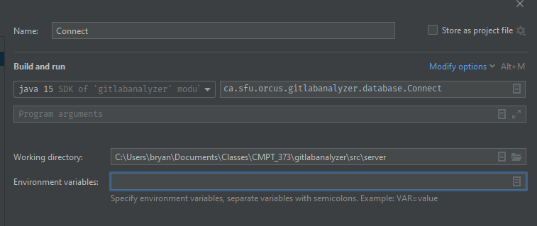
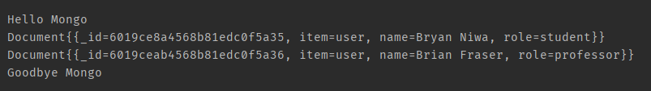

#

## 1. Cloning the Repo

```git clone https://csil-git1.cs.surrey.sfu.ca/373-2021-1-Orcus/gitlabanalyzer.git
```

## 2. Setting up React

1. Make sure [node and npm](https://nodejs.org/en/) are installed (LTS, not current).
    1. run `$ node -v` to confirm. anything 12.x.x or 14.x.x should be fine.
    2. run `$ npm -v` to confirm. anything 6.x.x should be fine.
2. Change directory to `/src/client`.
3. Install dependencies: `$ npm install`.

React should now be setup. Use `npm start` to start up the dev server, `npm test` to run tests and `npm run build` to build the project.

The dev server is auto-refreshing so saving any file in `src/client` will refresh the website with the changes.

### Optional Tooling

Assuming VSCode as the IDE, the following extensions are *strongly* recommended:

1. Prettier allows auto-saving to conform to a stlying guide, which will ensure coherent style.
    1. Go to the Extentions Tab
    2. Install Prettier  

    3. Open VSCode settings by clicking on the gear icon in the bottom left.  

    4. Change the `default formatter` to prettier.  

    5. Enable format on save.  


2. ESLint will enable highlighting of errors and issues as you code.
    1. Go to the Extentions Tab
    2. Install ESLint.  


## 3. Setting up Spring Boot

1. Install JDK version 15 [here](https://www.oracle.com/ca-en/java/technologies/javase-jdk15-downloads.html)
2. Install [IntelliJ IDEA Ultimate Edition](https://www.jetbrains.com/idea/download/#section=windows). If not already done, sign up for [GitHub student developer pack](https://education.github.com/pack) for a free license (allow up to 24 hours for a confirmation email so just use the 30 day free trial until then).
3. Add google-java-format IntelliJ plugin. [Instruction](https://github.com/google/google-java-format#intellij-android-studio-and-other-jetbrains-ides)
4. Open the /src/server folder inside IntelliJ and you should be good to go
5. To make sure everything is working:
    1. Click the run button

    2. In your browser, go to localhost:8080 and you should see some welcome text

## 4. Connecting to the MongoDB through IntelliJ

1. Once the project is open in IntelliJ, create a new "application" configuration for the "Connect" class with the following settings:

    1. The working directory should auto-fill to match yours
    2. Add an environment variable called "MONGO_URI" and set the value to the URL from the "connect" tab on the Mongo project page (Choose "Connect your application"). Make sure to replace \<user\> with just the word "user" and get the password from Discord. Change \<dbname\> to "Test"
2. Finally, run the configuration and you should see the following text displayed among a bunch of log information


## Postman

* Postman: Used to test API endpoints and send HTTP requests with a GUI - [https://www.getpostman.com/](https://www.getpostman.com/)
